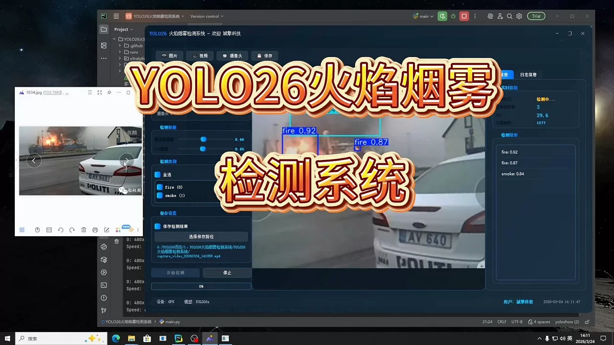
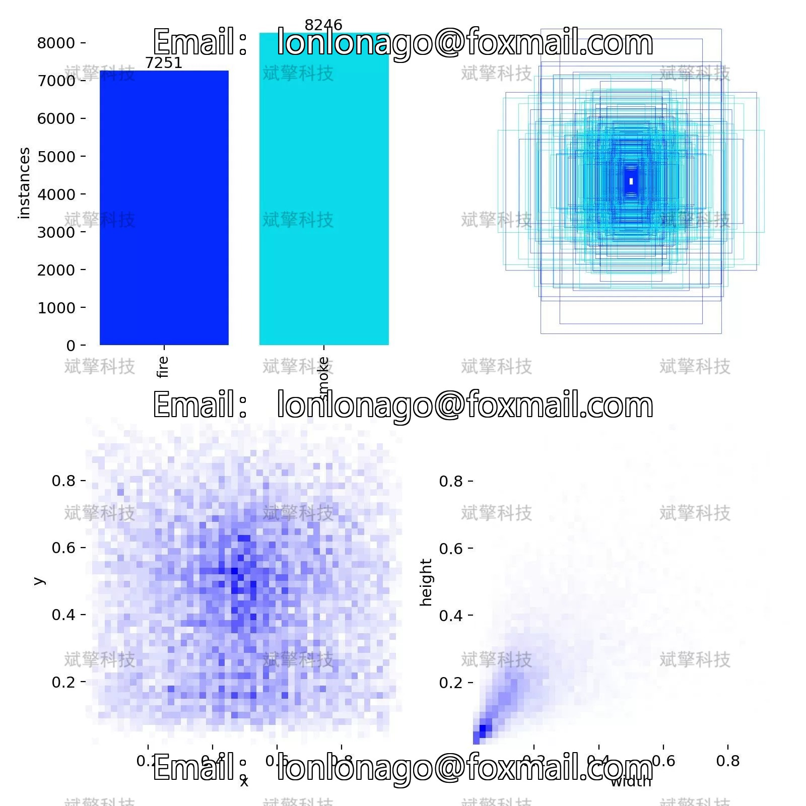
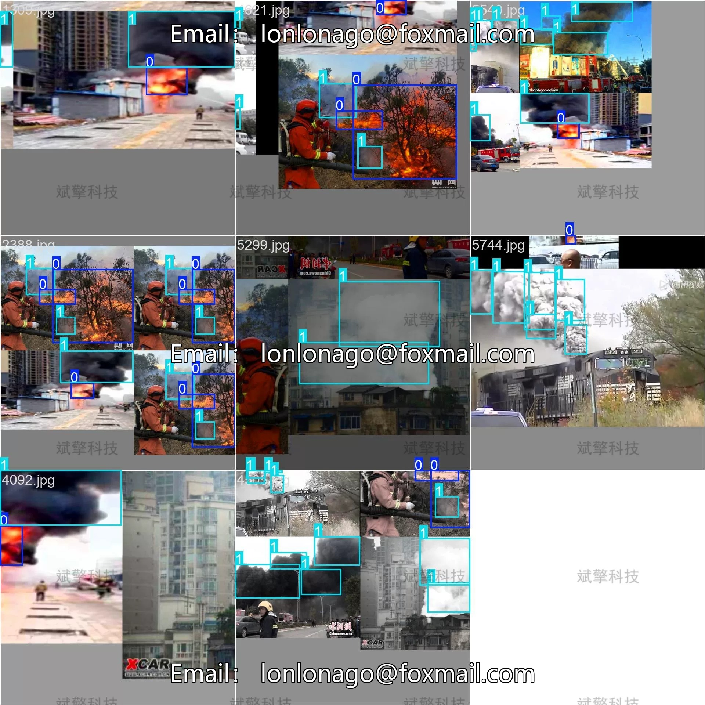
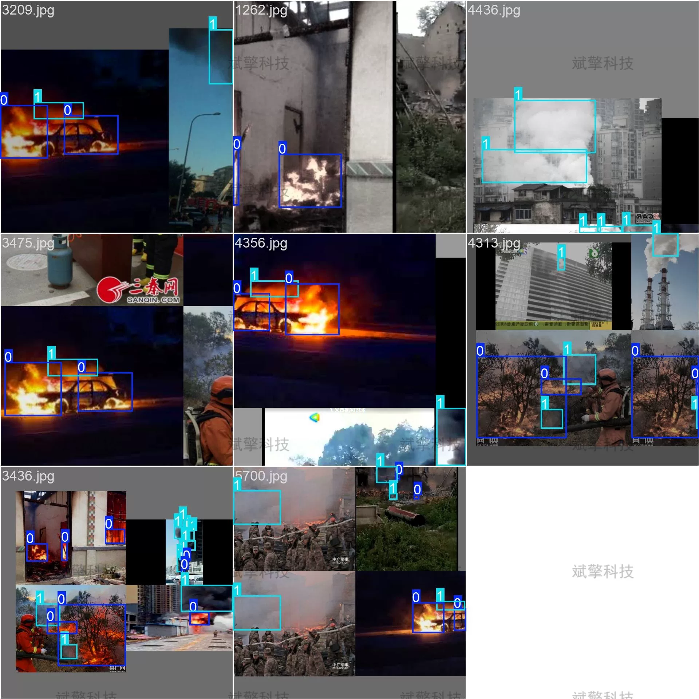
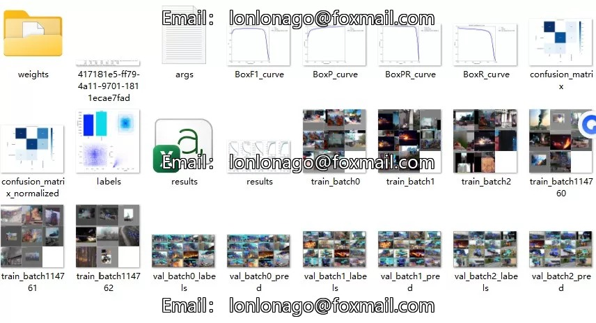
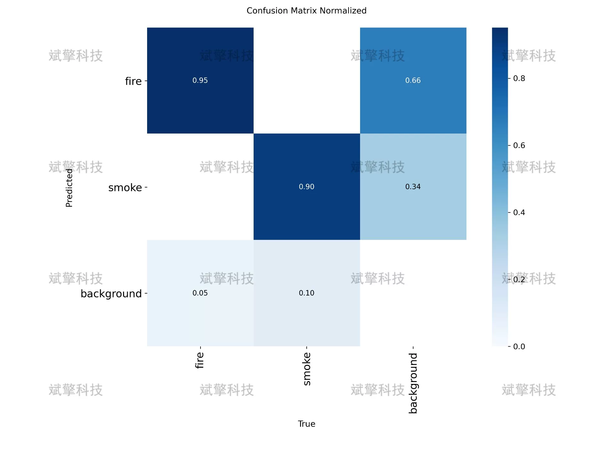
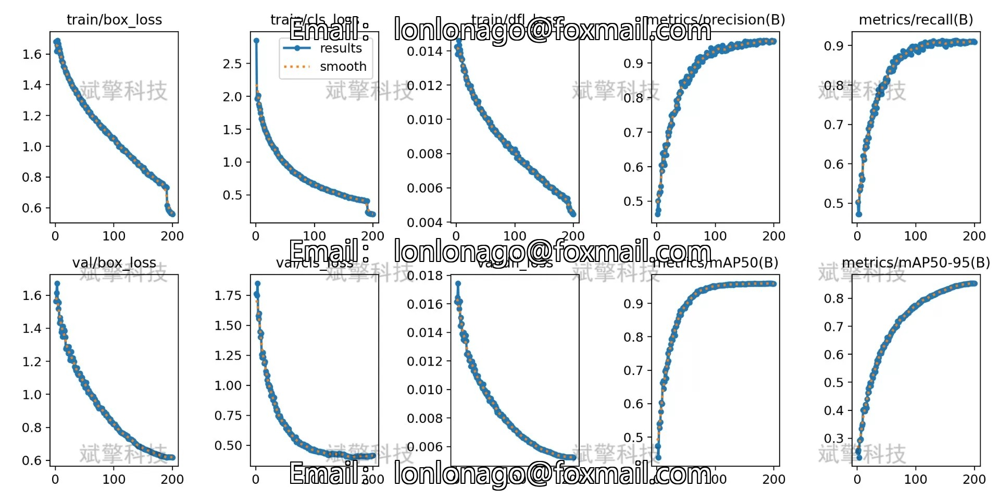
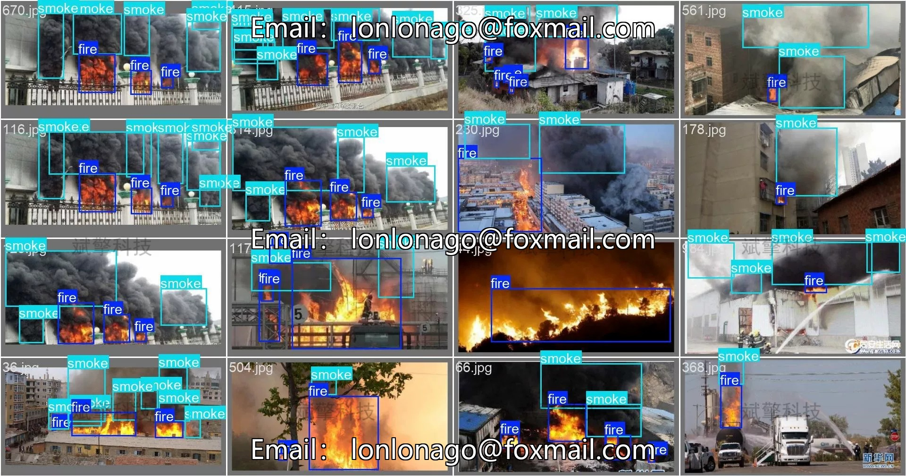
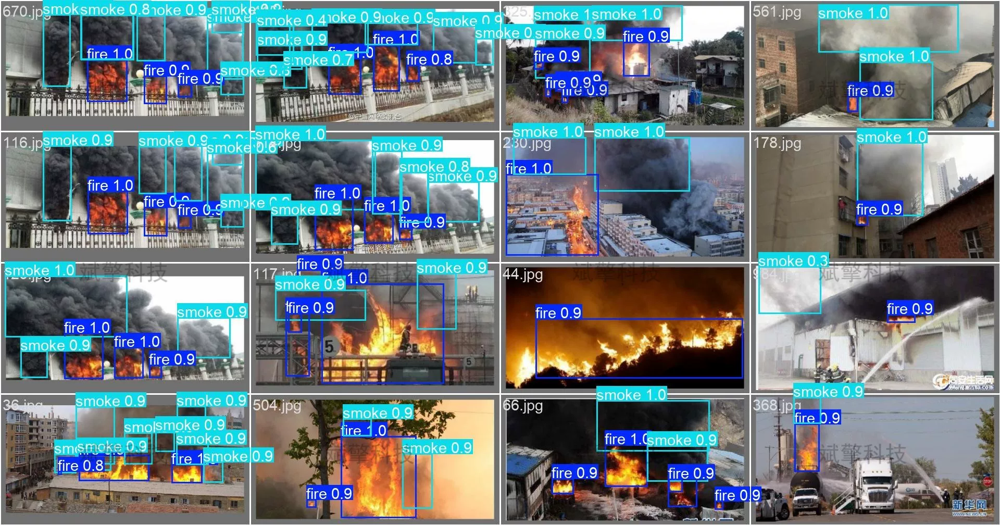

# YOLO26 Fire and Smoke Detection System | Source Code

## Body

YOLO26 Fire and Smoke Detection System | Source Code Build from Scratch: The Full Process of Data Set Construction, Model Training, and Deployment for Real-Time Detection Systems

Objective: Early intelligent detection of fires and smoke is of great significance for public safety warning. This study builds a real-time detection system targeting two types of targets (fires and smoke) based on the YOLO26 object detection algorithm, and conducts system training and evaluation on a large-scale dataset.
Method: A dataset containing 6744 labeled images was constructed, with 4832 training images, 1000 validation images, and 912 test images, totaling over 12,000 instances. Using the YOLO26 architecture as the basic detection model, the model's performance was evaluated using metrics such as precision, recall, mean average precision (mAP), and confusion matrix analysis to examine the misclassification between categories.
Results: On the validation set containing 1000 images, the overall mAP50 reached 0.96. For fire detection, the mAP50 was 0.972, with a recall rate of 0.931; for smoke detection, the mAP50 was 0.947, with a recall rate of 0.891. Confusion matrix analysis showed that there was some degree of feature confusion between fires and smoke, mainly manifested as some fire samples being misjudged as smoke. The training curve indicates that the model converged well without overfitting.

Total Image Count: 6744
Training Set: 4832
Validation Set: 1000
Test Set: 912
Target Categories: 2 classes (Fire, Smoke)
Labeled Instances: Over 12,000

Free reservation for remote installation. Unsuccessful refund guaranteed.
Purchase includes the following resources (unlocked in Baidu Cloud):
   - Complete source code for YOLO recognition detection projects
   - YOLO format datasets
   - Training code + UI interface code
   - Trained model + results images
   - Software installer package
   - Add WeChat for remote installation (shown automatically after purchase) - Unsuccessful, full refund guaranteed

⚙️ Core Functional Modules
Detection Capability
    Image Detection: Upon upload, returns detection boxes + category information
    Video Detection: Supports video files, analyzes frames accurately
    Camera Real-Time Detection: Integrates USB cameras for dynamic monitoring
Interaction and Control
    Target Filtering: Choose one or more categories for detection
    Parameter Real-Time Adjustment: Adjustable confidence threshold & IoU threshold, flexible control of accuracy
    Result Save: One-click save of image/video/camera detection results
System and Data
    User Login and Registration: Supports password strength check + encryption storage
    Log Recording: Auto-records operation and error information (timestamped)

## Images

## Payment

Here is a pay link on Stripe ( https://buy.stripe.com/3cs8yP7sY87d0vu9AB ). Please contact me lonlonago@foxmail.com after funding $89, and I will send you a complete data files , thank you!

